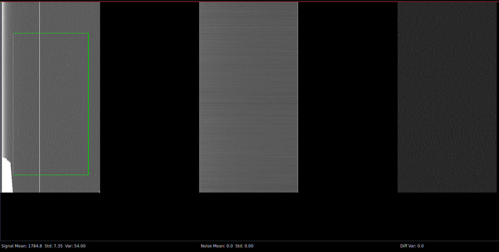
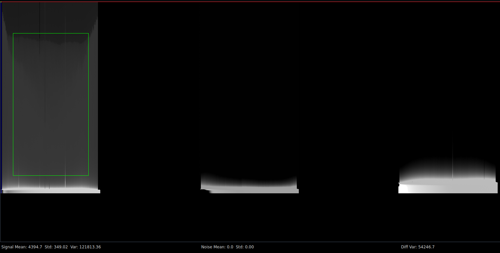
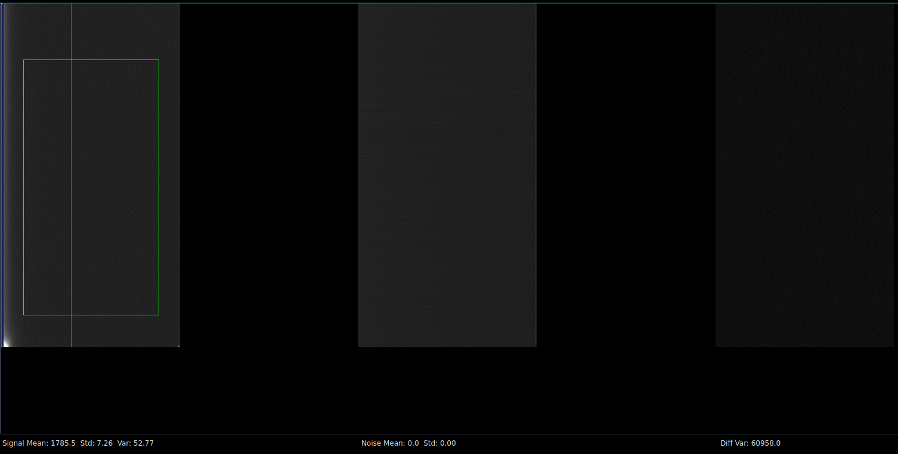

# CDS Raw Tap

- Tap 6 shows all high
- Tap 7 shows all 55k
- Tap 9 shows all 35k
- Tap 10 shows mostly 33k with jumps to 35k
- Tap 11 shows real signal

# Notes:

## 22136e31dd26f7e5e04a2b4f5b10814803dc1732

Some progress but cant get laser to show up

Changed the clamp time and shifting to A

# b303dbb93cbf10946de8b06b761a6714875d1e3d

Changed directon of parallel shifting by swapping the order of p2 and p3

Still shifting to A

Seems to make detector #1 show something but still not anything too interesting

Turning the laser on makes more vertical lines appear and raises the mean

Time to systematically try all serial and parallel combinations
Serial Options: SA, SB, SC
Parallel Options: PA, PB, PC

| Serial Logical | Serial Physical |  Completed  |
|----------------|-----------------|-------------|
| ABC            | 123             |  Yes        |
| ACB            | 132             |  ___        |
| BAC            | 213             |  ___        |
| BCA            | 231             |  ___        |
| CAB            | 312             |  ___        |
| CBA            | 321             |  ___        |

| Parallel Logical | Parallel Physical |  Completed  |
|------------------|-------------------|-------------|
| ABC              | 123               |  Yes        |
| ACB              | 132               |  ___        |
| BAC              | 213               |  ___        |
| BCA              | 231               |  ___        |
| CAB              | 312               |  ___        |
| CBA              | 321               |  ___        |

## Output transistor measurements
| RG_L (V) | RG_H (V) | RD (V) | OS_Hi_1 (V) | OS_Lo_1 (V) | OS_Hi_2 (V) | OS_Lo_2 (V) | OS_Hi_3 (V) | OS_Lo_3 (V) |
|----------|----------|--------|-------------|-------------|-------------|-------------|-------------|-------------|
|        0 |       10 |     12 |        19.9 |          18 |       20.45 |       19.13 |       19.21 |       16.09 |
|        0 |       10 |     14 |       21.15 |       18.09 |       21.65 |       19.24 |       20.61 |       16.12 |
|        0 |       10 |     16 |        22.3 |       18.17 |       22.69 |       19.33 |       21.68 |       16.15 |
|        0 |       12 |     12 |        19.9 |          18 |       20.45 |       19.14 |       19.21 |       16.03 |
|        0 |       12 |     14 |       21.15 |       18.09 |       21.66 |       29.23 |       20.61 |       16.09 |
|        0 |       12 |     16 |       22.31 |       18.17 |       22.69 |       19.33 |       21.93 |       16.14 |
|        0 |       14 |     12 |        19.9 |          18 |       20.45 |       19.13 |       19.21 |       16.09 |
|        0 |       14 |     14 |       21.15 |       18.09 |       21.65 |       19.24 |       20.61 |       16.07 |
|        0 |       14 |     16 |       22.31 |       18.17 |       22.69 |       19.33 |       21.93 |       16.13 |
|       -5 |        8 |     12 |        19.9 |       15.68 |       20.45 |       16.77 |       19.22 |       14.74 |
|       -5 |        8 |     14 |       21.15 |       15.82 |       21.66 |       16.86 |       20.61 |       14.79 |
|       -5 |        8 |     16 |       22.11 |       16.01 |       22.69 |       16.95 |        20.8 |       14.84 |
|       -5 |       12 |     12 |        19.9 |        15.7 |       20.45 |       16.77 |       19.22 |       14.74 |
|       -5 |       12 |     14 |       21.14 |       15.82 |       21.66 |       16.86 |       20.61 |       14.79 |
|       -5 |       12 |     16 |       22.31 |       16.02 |       22.69 |       16.95 |       21.93 |       14.84 |
|        5 |       12 |     12 |        19.9 |       18.42 |       20.45 |       19.54 |       19.22 |       16.56 |
|        5 |       12 |     14 |       21.15 |       18.51 |       21.66 |       19.64 |       20.61 |       16.59 |
|        5 |       12 |     16 |       22.31 |       18.59 |       22.69 |       19.74 |       21.93 |       16.61 |
|       -5 |        5 |     12 |       19.91 |       15.72 |       20.46 |       16.77 |       18.95 |       14.75 |
|       -5 |        5 |     14 |       20.59 |       15.83 |       21.64 |       16.86 |       19.03 |       14.79 |
|       -5 |        5 |     16 |       20.69 |       16.02 |       21.76 |       16.95 |        19.1 |       14.84 |
|        0 |        5 |     12 |        19.9 |          18 |       20.45 |       19.14 |       18.89 |       16.09 |
|        0 |        5 |     14 |       20.59 |        18.1 |       21.64 |       19.24 |       18.96 |       16.16 |
|        0 |        5 |     16 |       20.68 |       18.18 |       21.75 |       19.33 |       19.02 |       16.22 |

## Output transistor gains
| RG_L (V) | RG_H (V) | RD (V) | OS_Hi_1 (V) | OS_Hi_2 (V) | OS_Hi_3 (V) |
|----------|----------|--------|-------------|-------------|-------------|
|        0 |       10 |     12 |             |             |             |
|        0 |       10 |     14 |       0.625 |         0.6 |         0.7 |
|        0 |       10 |     16 |       0.575 |        0.52 |       0.535 |
|        0 |       12 |     12 |             |             |             |
|        0 |       12 |     14 |       0.625 |       0.605 |         0.7 |
|        0 |       12 |     16 |        0.58 |       0.515 |        0.66 |
|        0 |       14 |     12 |             |             |             |
|        0 |       14 |     14 |       0.625 |         0.6 |         0.7 |
|        0 |       14 |     16 |        0.58 |        0.52 |        0.66 |
|       -5 |        8 |     12 |             |             |             |
|       -5 |        8 |     14 |       0.625 |       0.605 |       0.695 |
|       -5 |        8 |     16 |        0.48 |       0.515 |       0.095 |
|       -5 |       12 |     12 |             |             |             |
|       -5 |       12 |     14 |        0.62 |       0.605 |       0.695 |
|       -5 |       12 |     16 |       0.585 |       0.515 |        0.66 |
|        5 |       12 |     12 |             |             |             |
|        5 |       12 |     14 |       0.625 |       0.605 |       0.695 |
|        5 |       12 |     16 |        0.58 |       0.515 |        0.66 |
|       -5 |        5 |     12 |             |             |             |
|       -5 |        5 |     14 |        0.34 |        0.59 |        0.04 |
|       -5 |        5 |     16 |        0.05 |        0.06 |       0.035 |
|        0 |        5 |     12 |             |             |             |
|        0 |        5 |     14 |       0.345 |       0.595 |       0.035 |
|        0 |        5 |     16 |       0.045 |       0.055 |        0.03 |

# Latest Commit

This commit will attempt to evaluate all combinations of the 